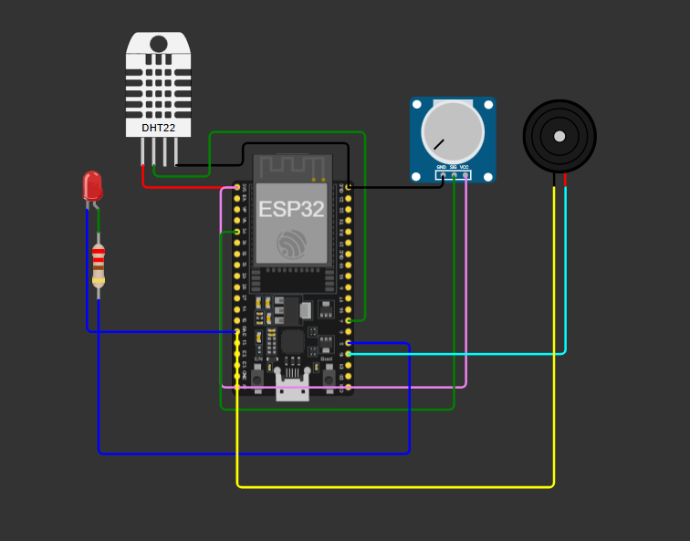
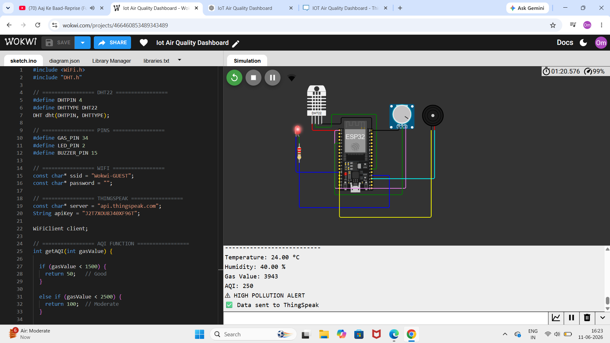
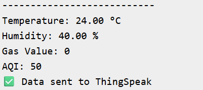
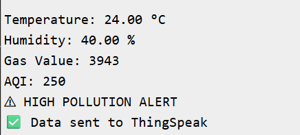
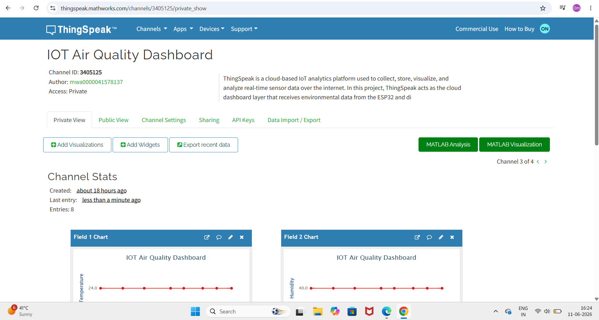
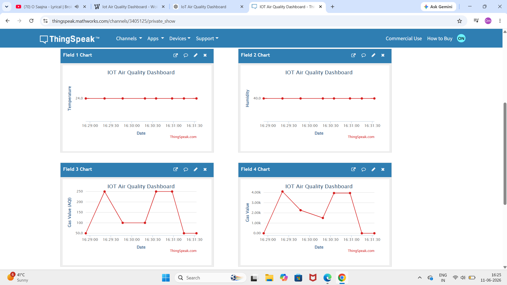

# 🌍 IoT-Based Air Quality & Pollution Monitoring Dashboard

An industry-oriented **IoT Air Quality Monitoring System** built using **ESP32, Wokwi Simulation, ThingSpeak Cloud, DHT22, and MQ135 Simulation (Potentiometer)** for real-time environmental monitoring and pollution analysis.

This project monitors **temperature, humidity, gas concentration, and Air Quality Index (AQI)** and provides **real-time alerts** using LED and buzzer when pollution levels become hazardous.

🔗 GitHub Repository: https://github.com/Procode19/Iot-air-quality-monitoring-dashboard

---

## 📌 Project Overview

Air pollution is one of the major environmental challenges affecting human health, industries, smart cities, schools, hospitals, and residential areas.

This project provides a **real-time IoT-based monitoring solution** to measure environmental conditions and pollution levels using sensors connected to an **ESP32 microcontroller**.

The collected sensor data is transmitted to the **ThingSpeak cloud platform**, where users can monitor live environmental conditions through graphs and dashboard visualizations.

---

## ❓ Problem Statement

Traditional air quality monitoring systems are expensive and not easily accessible for students or small-scale environments.

This project solves the problem by creating a:

✅ Low-cost solution  
✅ Beginner-friendly IoT project  
✅ Cloud-connected monitoring dashboard  
✅ Real-time alert system  
✅ Smart environmental monitoring platform

---

## 🎯 Objectives

- Monitor environmental conditions in real time
- Measure temperature and humidity
- Simulate air pollution monitoring using MQ135 logic
- Calculate Air Quality Index (AQI)
- Generate alerts during hazardous conditions
- Upload live data to ThingSpeak cloud
- Visualize environmental trends through graphs

---

## 🛠 Tech Stack

### Hardware / Simulation
- ESP32
- DHT22 Sensor
- Potentiometer (MQ135 Simulation)
- LED
- Buzzer
- Wokwi Simulator

### Cloud Platform
- ThingSpeak

### Software
- Arduino IDE
- VS Code
- GitHub

---

## ⚙️ Components Used

| Component | Purpose |
|-----------|----------|
| ESP32 | Main microcontroller with Wi-Fi |
| DHT22 | Measures temperature and humidity |
| Potentiometer | Simulates MQ135 gas sensor |
| LED | Pollution alert indicator |
| Buzzer | Hazardous air alert |
| ThingSpeak | Cloud dashboard for monitoring |
| Wokwi | IoT simulation platform |

---

## 🏗 Project Architecture

```text
Air Quality Sensors
(DHT22 + MQ135 Simulation)
            ↓
         ESP32
            ↓
   Data Processing
            ↓
      AQI Calculation
            ↓
   ThingSpeak Dashboard
            ↓
   Alert Generation
      (LED + Buzzer)
            ↓
 Real-Time Monitoring
```

---

## 🔄 Project Workflow

```text
Sensor Data Collection
        ↓
ESP32 Processing
        ↓
AQI Classification
        ↓
ThingSpeak Cloud Upload
        ↓
Real-Time Dashboard
        ↓
Alert Triggering
```

---

## 🌫 AQI Classification Logic

| AQI Range | Category | Status |
|-----------|-----------|--------|
| 0–50 | Good | 🟢 Clean Air |
| 51–100 | Moderate | 🟡 Acceptable |
| 101–150 | Poor | 🟠 Unhealthy |
| Above 150 | Hazardous | 🔴 Dangerous |

---

## ☁️ ThingSpeak Dashboard Setup

### Channel Information

**Channel ID:** `3405125`

### Configured Fields

| Field | Data |
|-------|------|
| Field 1 | Temperature |
| Field 2 | Humidity |
| Field 3 | AQI |
| Field 4 | Gas Value |

### Features
- Real-time monitoring
- Cloud visualization
- Environmental analytics
- Pollution trend graphs
- AQI tracking

---

## 🔌 Circuit Connections

### DHT22 Sensor

| DHT22 Pin | ESP32 |
|-----------|-------|
| VCC | 3.3V |
| GND | GND |
| DATA | GPIO 4 |

---

### Potentiometer (MQ135 Simulation)

| Potentiometer Pin | ESP32 |
|------------------|-------|
| VCC | 3.3V |
| GND | GND |
| SIG | GPIO 34 |

---

### LED

| LED | ESP32 |
|-----|-------|
| Positive | GPIO 2 |
| Negative | GND |

---

### Buzzer

| Buzzer | ESP32 |
|---------|------|
| Positive | GPIO 15 |
| Negative | GND |

---

## 📂 Project Structure

```text
IoT-Air-Quality-Pollution-Monitoring-Dashboard/
│
├── arduino_code/
│   └── air_quality_monitoring.ino
│
├── python_simulation/
│
├── dashboard/
│   └── thingspeak_setup.md
│
├── data/
│
├── outputs/
│
├── images/
│   ├── wokwi_circuit.png
│   ├── running_simulation.png
│   ├── serial_monitor_normal.png
│   ├── serial_monitor_alert.png
│   ├── thingspeak_dashboard.png
│   └── thingspeak_graph.png
│
├── circuit_diagram/
│
├── docs/
│
├── README.md
├── requirements.txt
├── .gitignore
└── main.py
```

---

## 🧪 Wokwi Simulation

This project was first developed and tested in **Wokwi Simulation** before hardware implementation.

Simulation includes:

✅ ESP32 Wi-Fi communication  
✅ DHT22 temperature & humidity monitoring  
✅ MQ135 simulation using potentiometer  
✅ AQI calculation logic  
✅ LED and buzzer alert system  
✅ ThingSpeak cloud integration

---

## 📸 Project Screenshots

### 🔌 Circuit Diagram

Shows complete ESP32 circuit wiring in Wokwi.



---

### ▶ Running Simulation

Shows live ESP32 simulation running successfully.



---

### 📟 Serial Monitor (Normal Condition)

Displays sensor values under safe air conditions.



---

### 🚨 Serial Monitor (Alert Condition)

Displays hazardous pollution levels and alert generation.



---

### ☁️ ThingSpeak Dashboard

Displays complete cloud dashboard with all sensor fields.



---

### 📈 ThingSpeak Graph

Displays sensor trends and AQI visualization.



## 🚨 Alert System

The system activates alerts when pollution exceeds threshold:

### Normal Air Quality
- LED OFF
- Buzzer OFF

### Hazardous Air Quality
- LED ON
- Buzzer ON
- Pollution warning shown in Serial Monitor

---

## ▶ How to Run the Project

### Step 1
Clone Repository

```bash
git clone https://github.com/Procode19/Iot-air-quality-monitoring-dashboard.git
```

---

### Step 2
Open Arduino code in Arduino IDE

---

### Step 3
Open Wokwi simulation

---

### Step 4
Connect ThingSpeak fields

---

### Step 5
Run simulation and monitor dashboard

---

## 🌍 Real World Applications

- Smart Cities
- Environmental Monitoring
- Industrial Pollution Tracking
- School & College Safety
- Hospital Environment Monitoring
- Smart Homes
- Government Pollution Control

---

## 🚀 Future Improvements

- Real MQ135 Sensor Integration
- PM2.5 / PM10 Sensor Support
- Mobile App Dashboard
- SMS / Email Alerts
- AI-Based Pollution Prediction
- Multi-node Monitoring System

---

## 📚 Learning Outcomes

Through this project, I learned:

- IoT System Design
- ESP32 Programming
- Sensor Integration
- ThingSpeak Cloud Dashboard
- AQI Monitoring Logic
- Environmental Monitoring Systems
- GitHub Project Documentation

---

## 👨‍💻 Mentor

**Umesh Yadav**  
EDC IIT Delhi

---

## ⭐ Support

If you found this project useful, consider giving it a **star ⭐** on GitHub.

---

## 📜 License

This project is developed for educational and learning purposes.